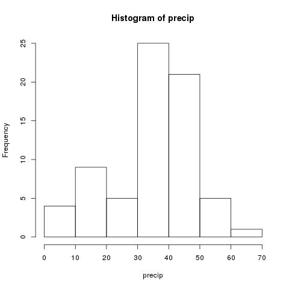
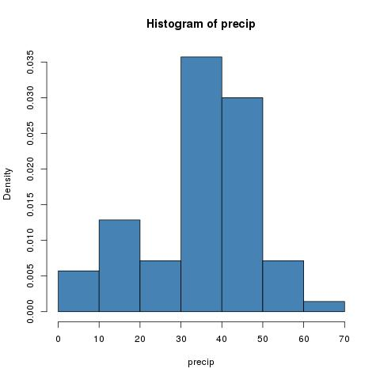
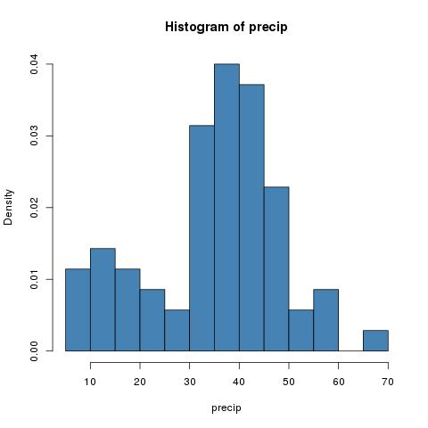
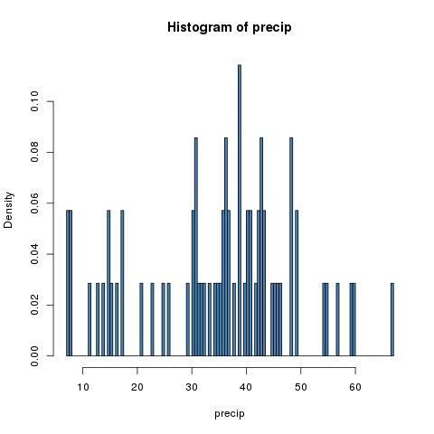

title: Descriptives
date: 2014-07-24 15:03
author: emisshula
category: R-course
tags: Emacs, Rstats, ESS
slug: r-descriptives-ess

> Say you were standing with one foot in the oven and one foot in an ice bucket. According to the percentage people, you should be perfectly comfortable. <a id="fnr.1" class="footref" href="#fn.1">1</a> ~Bobby Bragan, 1963

# Encountering data

Here we will describe the techniques you should use to give yourself and
your readers/bosses/teachers a good feel of the data. This is often called
*descriptive statistics*.  In this context a *statistic* is a single number
that summarizes your data. It is important to know what type of data you have
and the *level of measurement* but we will put off that discussion for a 
a few paragraphs.  I am also putting off a discussion of why statistics is 
important and I am just assuming that this is something you have to do in
order to do your research.

Here is the daunting part, your data is usually a long list of numbers.  How 
do you describe *that*?  Usually the first technique you want to use is to 
graph all of the numbers together.  In fact all of the data has a special name. 

Your data is called the sample distribution.  How do we get that data
into R?  Again, we will defer that question. One nice feature of R is
that it has some data built in.  For example, it has the average amount of 
precipitation for 70 cities in the United States.  We can use this data to 
illustrate a few techniqeus that you can use on your own data.

    str(precip)
    precip[1:4]

    Named num [1:70] 67 54.7 7 48.5 14 17.2 20.7 13 43.4 40.2 ...
    - attr(*, "names")= chr [1:70] "Mobile" "Juneau" "Phoenix" "Little Rock" ...
        Mobile      Juneau     Phoenix Little Rock 
          67.0        54.7         7.0        48.5

The `str` command gets the structure of the data.  There are a few commands 
for this `summary` is the other one I sometimes use. And `precip[1:4]` gave 
us the first four elements.  Here are some other built in datasets

    str(rivers)
    str(discoveries)

    num [1:141] 735 320 325 392 524 ...
    Time-Series [1:100] from 1860 to 1959: 5 3 0 2 0 3 2 3 6 1 ...

The first thing we want to get a sense of is how the numbers are
distributed.  The best way to this is to use a *histogram*.  A
histogram is a bar chart where we bin the count the number of
observations that fall in a defined range.  I allows us to quickly
notice important properties. `R` has a function for computing this
built in.

    hist(precip)

We can imporove this by passing two parameters.  The first is designating 
a color (`col`) and the second is not computing the frequency counts but
instead dividing by the total observations in our sample.

    hist(precip,col="steel blue",freq=FALSE)

Two important and frustrating things to note about histograms.  They
are highly dependant on the number of bins we choose.  We will show an
example below of manually setting the bins.  Second there is no
general algorithm for setting the number of bins.  We can only repeat
it for an increasing number of bins and stop when the shape is stable.
Now we are also supressing the printing of a title.  For more
parameters of `hist` type `?hist` at the console prompt.  Histograms
were first introduced by Karl Pearson.  

    hist(precip,breaks=10,col="steel blue",freq=FALSE)

    hist(precip,breaks=200,col="steel blue",freq=FALSE)

# The ugly history of statistics

Karl Pearson was a British mathematician. He is considered the founder
of mathematical statistics.  Dr. Pearson established the first
department of statistics in the world at University College, in
London. However, he was also the founding editor of the *Annals of
Eugenics*.  Dr. Pearson advocated for the restriction of immigration
by Jewish people to Britain on the basis that \`\`this alien Jewish
population is somewhat inferior physically and mentally to the native
population.'' <a id="fnr.2" class="footref" href="#fn.2">2</a>  He also thought that war between the races was
inevitable.

A number of prominent founders of statistics and biostatistics shared
Dr. Pearson's views.  I find that these embarassing facts are often
left out fo the history of statistics.  I think it is important to
remember these ugly warts so that we can separate these important
contributions from the ugly politics of their inventors allowing us to
use our research to make rather than inhibit social progress.

# Stem and leaf plots

Another older technique for exploring data is to draw a stem and leaf
plot.  These were popularized by John Tukey in his book *Exploratory Data
Analysis* <a id="fnr.3" class="footref" href="#fn.3">3</a>.  The leading digits of the data are the *stems* while
the final digits are the *leaves*.  The graph is drawn left to right with 
a vertical line separating the stem and leaves.

<h2 class="footnotes">Footnotes: </h2>

<a id="fn.1" class="footnum" href="#fnr.1">1</a> 
Robert Randall Bragan an American shortstop, catcher, manager, and coach in Major League Baseball.

<a id="fn.2" class="footnum" href="#fnr.2">2</a> 
Pearson, Karl, & Moul, Margaret (1925). "The Problem of Alien Immigration into Great Britain, Illustrated by an Examination of Russian and Polish Jewish Children", Part II, Annals of Eugenics, Vol. I, No. 2, pp. 125-126.

<a id="fn.3" class="footnum" href="#fnr.3">3</a> 
ukey, John W. (1977). Exploratory Data Analysis (1 ed.). Pearson. ISBN 0-201-07616-0.

