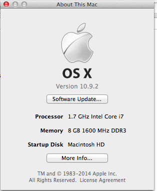
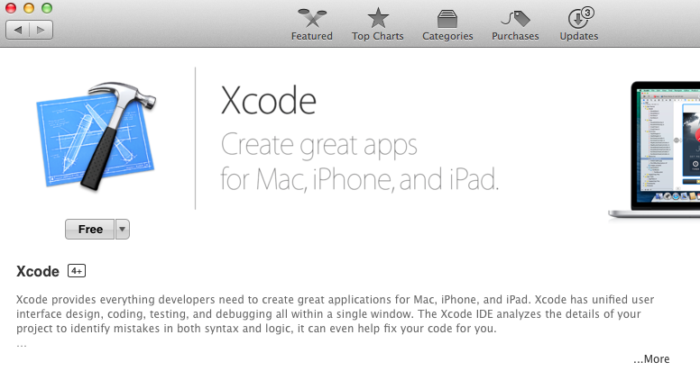
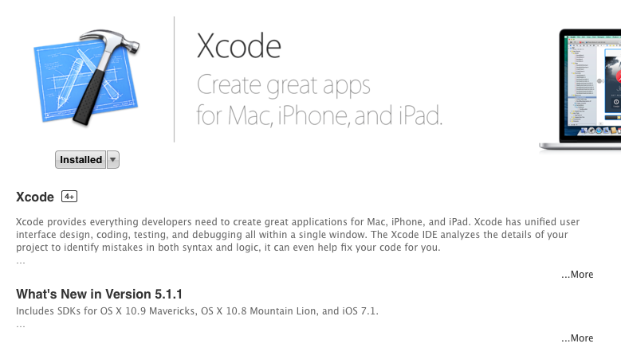
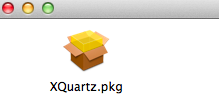
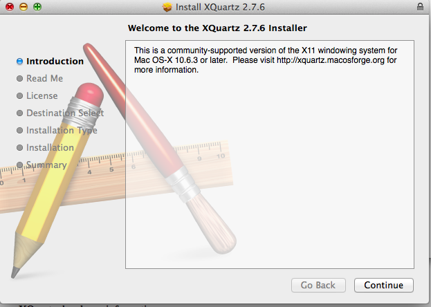
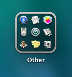
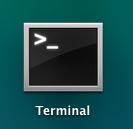
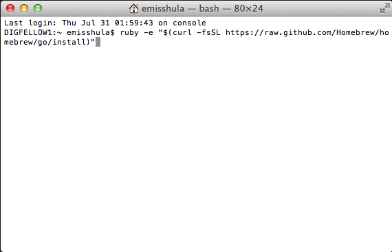

title: Mac OS X Installation
date: 2014-07-30 15:03
author: emisshula
category: R-course
tags: Emacs, Rstats, ESS, OS X
slug: mac-dev-env

> I have developed a Zen-like approach to the operating systems that
> people use: 'When you're ready, the right operating system will appear
> in your life.' ~Guy Kawasaki is the chief evangelist of Canva, an
> online graphic design tool. Formerly, he was an advisor to the
> Motorola business unit of Google and chief evangelist of Apple.

# Dev Environment

A development environment is one where you can make the software you
need to run.  You need this to run the latest free software which is
often only implemented in source code.  Particularly to take advantage
of common mathematical libraries you need a Fortran, C and C++
compiler even if you never use those languages directly.  Apple does
not include it in their default configuration because it does not want
you to create your own software, it want you to buy their software
products (rant over).

# Obtain the compilers

First you need to make sure that you have the latest operating system.
To do that, you need to left click on the Apple icon and read the release.

Then we have to obtain an [appleID](https://appleid.apple.com/) including submitting a credit card.
The good news is that they won't charge you.  We just need to obtain
the xcode which has Apple's development tools.  The only ones I have
ever used are the compilers which are FREE software.  Bottom line is,
legally they can't charge for them ([copyleft](https://www.gnu.org/philosophy/apsl.html)). Search in Google for 
"xCode download".  It will automatically detect your OS and if you have
Mac OS X installed, it will include the free button you need to press
to download it.

When it finishes downloading it will automatically install and and you 
will see the picture below. The only difference is a small button which 
now says installed. (Yay!)

> If you have any trouble sounding condescending, find a Unix user to
> show you how it's done. ~Scott Adams

# Obtain an alternate windowing library

The next step is to download the xQuartz project which let's the free
software on your machine open new windows.  Software needs to open new
windows if it needs to warn you about something so this is an
essential function.  You can find it at this [xQuartz link](http://xquartz.macosforge.org/landing/).  The file
is a dmg.  Since this is not an official Apple product it will be
saved in downloads.  [Here](http://www.ofzenandcomputing.com/how-to-install-dmg-files-mac/) is a link that explains in detail how to
install a dmg file.  A dmg is disc image file.  You need to left click
on it. That will open an empty box.  See picture below.  Double click
on the box and that will start an installer.  You will need to put in
your password. Also see picture further below.

You have to log back in and out for xQuartz to take effect.

# Obtain a package manager

Most distributions of Linux come with a package manager to sort out which
software depends on which other libraries.  These were a huge innovation
in the Linux world.  And there is a package manager for Mac OS X. It is 
called [Homebrew](http://brew.sh/). To install it we are going to need the terminal which
is hard to find on a Mac.  You need to left click the launcher icon.  See
picture below.

Then you need to find the terminal.  It is hiding in the other icon. See
the picture below and left click the similar image on your Mac.

Then left click the terminal icon, pictured below.

Now copy the Homebrew installation script (using command-C to copy and 
command V to paste) and paste it inside the terminal as pictured below:

Now press the [enter key].  You will be prompted for your password.  When
Homebrew finishes type `brew doctor` at the prompt. If all goes well
you will get a positive message.  As [Zed Jones](http://zmjones.com/mac-setup/) points out, we still need
to manually set the path. In the terminal type:

`sudo emacs /etc/paths`

You will have to change the file to look like this:

    /usr/local/bin
    /usr/bin
    /bin
    /usr/sbin
    /sbin

Type Ctrl-x Ctrl-s to save it and Ctrl-x Ctrl-c to quit.

# Obtain git

The first thing we need is git. Git is the source control and
collaboration software that is most popular in the FREE software
world. Type

    brew install git

# Obtain emacs

In order to be able to manipulate the files that contain our data and 
present our output, we need to obtain our editor, Emacs.

    brew install emacs --cocoa

Here again there are some quirks.  On Linux, we would simply use the
Emacs package manager but on Mac we have used the package manager
Homebrew so the Emacs package manager gui install button won't install
because of permission problems.  So we have to use the command interactive 
commands from Emacs.  No big deal, once you figure it out but it took a 
while to find it. I found this [post](http://howardabrams.com/projects/dot-files/emacs.html) helpful.  So we need to set up the 
Emacs repositories by creating a *.emacs* file. Any file with a '.' in front
is a hidden configuration file.  It will not appear when you type `ls` for 
list files at the command prompt.  You can edit them in Emacs `C-x C-f .emacs`.
Now we have to add the code below.  (Used `Command-C` to copy it and `Ctrl-Y`
in Emacs to paste/yank it.

    (require 'package)
    (setq package-archives '(("org"       . "http://orgmode.org/elpa/")
                             ("gnu"       . "http://elpa.gnu.org/packages/")
                             ("melpa"     . "http://melpa.milkbox.net/packages/")
                             ("marmalade" . "http://marmalade-repo.org/packages/")))
    (package-initialize)

Now just after this we can specify a programmatic way to check which
packages are installed.

    (defun filter (condp lst)
      "Emacs Lisp doesn’t come with a ‘filter’ function to keep elements that satisfy
    a conditional and excise the elements that do not satisfy it. One can use ‘mapcar’
    to iterate over a list with a conditional, and then use ‘delq’ to remove the ‘nil’
    values."
      (delq nil
            (mapcar (lambda (x) (and (funcall condp x) x)) lst)))
    
    (defun inverse-filter (condp lst)
      "A filter function, but returns a list of the entries that don't match the predicate."
      (delq nil
            (mapcar (lambda (x) (and (not (funcall condp x)) x)) lst)))
    
    (defun packages-install (packages)
      "Given a list of packages, this will install them from the standard locations."
      (let ((to-install (inverse-filter 'package-installed-p packages)))
        (when to-install
          (package-refresh-contents)
          (dolist (it to-install)
              (package-install it)
          (delete-other-windows)))))

# Emacs package to get the right environment

Now the first thing we should do is correct for another Mac induced 
problem. An Emacs instance started from the graphical user interface
will have a different environment than a sell in a terminal window.
This happens because OS X does not run a shell during login.  If the
environment is different you will get weird behavior when Emacs calls
external utilities like make.

    M-x package-install RET exec-path-from-shell-initialize

Then in the `.emacs` file add the following code:

    (require 'exec-path-from-shell)
        (when (memq window-system '(mac ns))
        (exec-path-from-shell-initialize))

At this point quit emacs `C-x C-c` and restart. 

# Emacs package to get the communicate with R (ESS)

Here again type `M-x package-install RET ess RET`.  This will 
install ESS. Find the *.emacs* file by typin `C-x C-f .emacs`
and add the following code.

    ;;ess-mode configuration
    (setq ess-ask-for-ess-directory t) 
    (setq inferior-R-program-name "/usr/local/bin/R") 
    (setq ess-local-process-name "R") 
    (require 'ess-site)

# Install R

Another weird quirk is that xCode has removed gcc which is the most
common set of compilers in the world.  They are what R expects to
encounter.  There are two alternatives.  You can build a late version
of the compilers via the instructions found at this [link](http://apple.stackexchange.com/questions/38222/how-do-i-install-gcc-via-homebrew) 

    brew install [flags] https://raw.github.com/Homebrew/homebrew-versions/gcc48.rb

Where [flags] should include all the required languages,
e.g. (&#x2013;enable-cxx &#x2013;enable-fortran).  Also see this [link](https://coderwall.com/p/lqpp8w) for an
example of how to create a symlink to make a newer version the
default.  However I got away with just installing version 4.2 (a seven
year old version of the gcc compilers by installing XCode Command Line
Tools. These are separate from XCode which I found confusing.  You can
install them with xcode-select &#x2013;install).  Then you can just type

    brew install gcc

Now that `gcc` is installed you can install R.

    brew tap homebrew/science #the R formula has been moved here
    brew install r

You can test the installation by typing `M-x R` in Emacs and 
you should have R inside of Emacs.  Next post will get Python 
set up.  I am betting our 4.2 version of gcc is not going to 
be good enough.

# Dedication

This post is dedicated to Matt Gold and the [GC Digital Fellows](http://digitalfellows.commons.gc.cuny.edu/) project
who were able to obtain for me not only access to a Mac but insured
that I would have admin rights to install software and create this 
tutorial. They bare no responsibility for any mistakes or omissions 
which are solely the responsiblity of the author.
