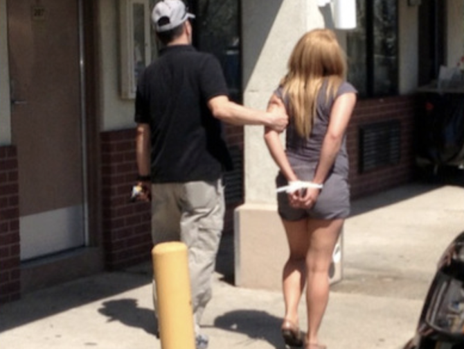

title: Arrest tweets
date: 2014-05-02 15:02
author: emisshula
category: Criminal Justice
tags: policing, public-shame, sex-workers
slug: arrest-tweet

Of course, one reason why it might be unprecedented is that other
police forces might find it prurient, ludicrous, voyeuristic, perverse
or merely a monstrous waste of time, money and a cell
phone. #TweetingArrests 
<http://www.cnet.com/news/police-to-live-tweet-prostitution-sting/>

