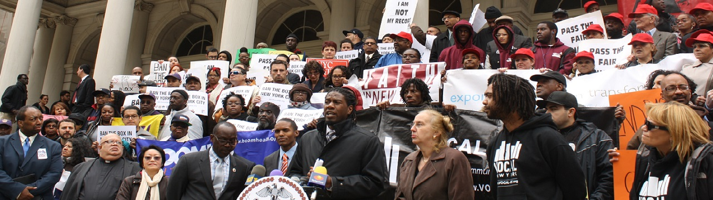

title: Ban the box
date: 2014-05-02 15:02
author: emisshula
category: Criminal Justice
tags: reentry, jobs
slug: ban-the-box

NYC is considering banning private employers from asking about
criminal convictions on employment applications.  If NYC passes this,
it is a game changer.  Once again Jumaane Williams is leading the
charge on behalf of the working poor.

-   [wsj-online](http://online.wsj.com/news/articles/SB10001424127887323997004578640623464096406)
-   [cssny](http://www.cssny.org/news/entry/watch-fair-chance-act-would-ban-the-box-in-nyc)
-   [fairChance.org](http://fairchancenyc.wordpress.com/)

