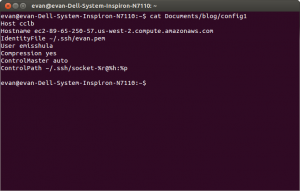
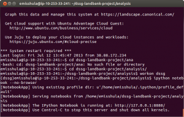
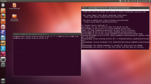

title: Emacs IPython Notebook and "ESS in the Cloud"
date: 2013-07-12 02:41
tags: emacs, python, IPython, Rstats, ESS
author: emisshula
category: Tutorials
slug: emacs-ipython-notebook-and-ess-in-the-cloud

# My usage history

Back in 2009, one of the first advantages that made me play around
with [Emacs](http://www.gnu.org/software/emacs/) again when I went back to graduate school was
[Emacs-Speaks-Statistics](http://ess.r-project.org/index.php?Section%3Dhome). It allowed me to avoid the pain of using the
R-console which was frankly a miserable experience. The deficiencies
of that interface stood in stark contrast to the enormous benefits to
be had by using a [FREE](http://www.fsf.org/about/) and open source statistical computing
environment where each function could be examined and verified. Data
analysis was no longer tied to a machine with a working license
server. I could now work from home or even on my lengthy commute from
Coney Island to school in Manhattan.  Three dead hours of my day now
became my most productive time. Although I do not have the resources
to donate to the project I have cited it in my scientific work and
encourage others who have used it to do the same.

# R vs Python

Although R has continued to improve since I started using it. The
Python Data community has truly blossomed, albeit from a much lower
base. Tools like numpy, scipy networkx, NLTK, sympy, pandas, rpy2 and
particularly IPython have made Python a formidable competitor in the
scientific computing space. In fact I am not going to give links to
the source code because best practice is to install them in a virtual
environment using pip.  The best instructions I have found for Linux
are [here](http://technomilk.wordpress.com/2011/07/27/setting-up-our-django-site-environment-with-pythonbrew-and-virtualenv/).  I will write a tutorial for Mac and Windows next week. The
reason why IPython has had such a profound impact are human rather
than technical.  IPython prints detailed error messages where as R
prints error messages that are cryptic at best. Python has a vibrant
community with numerous initiatives to reach under-served,
under-computed and under-represented groups including [PyLadies](http://www.pyladies.com/) and
[other-groups](http://wiki.python.org/moin/DiversityInPython). R help is notoriously caustic.

# How caustic?

Funny you should ask.  Trey Causey a PhD student at University of
Washington (where R. Doug Martin used to teach statistics and owned
the R predecessor language [S+](http://en.wikipedia.org/wiki/S-PLUS)) wrote a [blog-post](http://badhessian.org/2013/04/has-r-help-gotten-meaner-over-time-and-what-does-mancur-olson-have-to-say-about-it/) asking whether R-help
had gotten meaner.  There are 20 comments on his post and it generated
a response article by Columbia's [Andrew-Gelman](http://andrewgelman.com/2013/07/10/please-send-all-comments-to-devripley/) who has an 35,174
citations and h-index of 63. (That is 63 papers cited at least 63
times.) I took a less sophisticated approach. I read their
[posting-guide](http://www.r-project.org/posting-guide.html) and answers and I vowed to never ask a question. If I
want to be abused like that I will go find a job on a trading desk.
But searching the archives and other sources, I got by.

# IPython Notebook

I discovered the notebook from this post on R-bloggers back in
November 2012. The browser was a great way to show work across
various operating systems. But whoa, did this mean I actually had
to edit in the browser. Christ! It was like using Word, or
Notepad++.  Surely we can do better. Well I couldn’t, but Takafumi
Arakaki could.  He made the IPython Notebook a mode in Emacs. A
powerful editor, the ability to work interactively and display the
results in the browser where bosses, students and PI’s feel at
home. If you have not set it up, please read my tutorial. But at
the [Data Science for Social Good](http://dssg.io/) Fellowship.I am looking at data
that is simply to big for my laptop. I needed to run IPython
remotely on an amazon ec2 instance but edit the interactive session
locally.  These servers have no windowing software (x11) and it
violates the terms of service to install it. There were a few
choices.

1.  Run IPython remotely (on the instance) and edit it a local
    non-window version of Emacs.
2.  Run IPython remotely on a public ip over http. (This is a
    **really** bad idea for reasons I will explain.)
3.  Run IPython remotely on a public ip over SSL/TLS with a
    password.(A somewhat less bad idea bad idea.)
4.  Run IPython remotely on a port on the remote localhost, 127.0.0.1
    and forward that port to our local localhost (no typo there) via
    ssh. Then we can pick it when we open the notebook list in
    Emacs. The command is M-x ein:notebooklist-open. 'M' here, is
    'Meta' which on Linux or Windows is mapped to the Alt key and on
    Mac is mapped to the command key.

# Why everything sucks but the last option.

1.  If you edit on the remote machine you are using Emacs inside the
    bash shell. Any extended key-bindings don't work including the
    bindings for the emacs-ipython notebook (ein). Everytime I wanted
    to execute a cell I had to type `M-x
         ein:notebook-execute-and-goto-next` insteand of M-RET. **That sucks!**
2.  Run IPython remotely on a public ip over http. Whoa, now we have a
    process listening that can execute linux commands on a shared
    remote computer that is completely unsecured. **That sucks!**
3.  Run IPython remotely on a public ip over SSL/TLS with a
    password. Ok, so this is what the IPython documentation
    suggests. Here is the [link](http://ipython.org/ipython-doc/dev/interactive/htmlnotebook.html) and you should also check out this
    github [repo](https://github.com/ipython/ipython-in-depth/blob/master/notebooks/Running%2520a%2520Secure%2520Public%2520Notebook.ipynb). The difference is what they name the key and
    certificate but the first set of instructions did not work for me
    while the second did. Choose a good password it probably is no
    worse than buying a book at Amazon. But it still leaves you
    editing in the browser. **That sucks!**
4.  Finally the fourth option is confusing but it gets done what we
    want. The important thing to understand is that we need to forward
    the remote machine's local port to our localhost using -L option
    in ssh. The best explanation I could find is [here](http://www.kirsle.net/blog/kirsle/ssh-port-forwarding) in the section
    on Forwarding Local Ports to Remote. This is hard, but **it does
    not suck!**

# Instructions

Start on your machine. Set up a .ssh/config file where you define the 
host and identity. Good directions are [here](http://blog.i-evaluation.com/2012/11/19/ec2-ssh-configuration-with-pem-keys/). It is worth stating, the
**local** machine is your laptop and the **remote** is the server you are
using. The result is that establishing an ssh connection should be as
easy as:

    $ ssh myServer

-   Here is a sample config file based on my own. This will not work
    on your machine.

-   Configure ein. See my [issue](https://github.com/tkf/emacs-ipython-notebook/issues/created_by/EvanMisshula?state%3Dopen) on the ein repo to set your
    `ein:console args` I set up a profile locally rather than used
    sshfs as Takafumi suggested. The directions are in this [repo](https://github.com/ipython/ipython-in-depth/blob/master/notebooks/Running%2520a%2520Secure%2520Public%2520Notebook.ipynb). If
    you are using a virtual environment, the configuration will be
    in: `~/.config/ipython`

-   Make a directory on the remote machine to put your notebook
    files. Start the server normally.

    $ ipython notebook --pylab=inline --no-browser --port=6000

-   From another terminal on your local machine:

    $ ssh -N -f -L 7000:127.0.0.1:6000 myServer

-   Open emacs. Type: `M-x ein:notebooklist-open`. When Emacs asks
    which port say 7000.

Congratulations, you now have an ssh connection to your notebook on a
remote server in local emacs. And you know what, that my friend, **does
not suck at all.**

You can download the R-language by following this [R-link](http://cran.us.r-project.org/) and Vincent
Goulet generously makes [Emacs with ESS](http://vgoulet.act.ulaval.ca/en/emacs/) available through his website
for both Mac OS X and Windows.