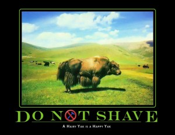
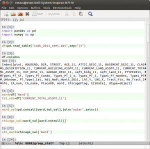

title: Emacs IPython Notebook and the shaving of a Yak
date: 2013-06-25 09:02
tags: big data, Emacs, emacs-ipython-notebook, ipython, programmer-humor,configuration, emacs, IPython, linux, statistics
author: emisshula
category: Tutorials
slug: emacs-ipython-notebook-and-the-shaving-of-a-yak

# Motivation

It was this week during the project pitch exercise here at the [Data
Science For Social Good](http://dssg.io/) that I fell down a rabbit hole. I wanted to
get summary statistics on foreclosures and land values for each of
Chicago's 50 wards.  Of course I was not doing that when the well
known data scientist and volunteer mentor [Max Shron](http://shron.net/) approached me
while I was fiddling with my editor. He politely introduced me to the
concept of a **Yak Shave**. As the definitive source of programming
slang, the [Jargon file](http://www.catb.org/jargon/html/go01.html) file defines it:

> [MIT AI Lab, after 2000: orig. probably from a \*Ren & Stimpy episode.\*]
> Any seemingly pointless activity which is actually necessary to solve a
> problem which solves a problem which, several levels of recursion later,
> solves the real problem you're working on.

Now there is some disagreement over whether this is a term of
derision.  [Wiktionary](http://en.wiktionary.org/wiki/yak_shaving) includes an alternate meaning:

The actually [useless](http://en.wiktionary.org/wiki/useless) [activity](http://en.wiktionary.org/wiki/activity) you do that appears important when you
are consciously or unconsciously procrastinating about a larger
problem.

> I thought I'd get more work done if I just fixed a problem with my
> .emacs file, but then I spent the whole afternoon *yak shaving*.

This was what Max was gently chiding me for. After all, I am a PhD
student our lives are devoted to the idea of Yak Shaving, even if we
don't have a name for it. We all want to make our projects work without
admitting to our advisers that we are stuck on step 3 of our weekly 50
part research assignment. So I put down my fiddling and went to the
meeting but I did not forget about it. The culture of our group is
nothing if not polite and friendly.

Now the truth is that this piece of out is slightly over 1 GB and I
could have done all of my data cleaning in R. However we all know that
Python and Pandas are the better tools and we are trying to come up to
speed quickly.  (For those of us on twitter, [John Myles White](https://github.com/johnmyleswhite), has
been working on the next interpreted language to enter the speed wars,
[Julia](http://julialang.org/)). This idea of yak-shaving had me giggling for an hour. I am a
recent convert to gnu/linux and  the gnu part of that partnership is
[FREE Software](http://www.fsf.org/) with deep collectivist roots and installation procedures
reminiscent of Dostoevsky novel if it works or years in Gulag if they
don't. Their GNU mascot looks like a close relative of the Yak.

# Emacs IPython Notebook

Even the Wikitionary entry on useless yak shaving mentions the
notoriously arcane .emacs file that needs to be constantly
configured. These days may be coming to an end.  Not that I did not
spend the better part of a sick day fiddling with it to get two pieces
of canonical free software virtuosity, [Fernando Perez](http://fperez.org)'s [IPython](https://github.com/fperez) and
[Richard Stallman](http://stallman.org/)'s [Emacs](http://www.gnu.org/software/emacs/) to play together well.  First, I found the
brilliant [ein library](https://github.com/tkf/emacs-ipython-notebook) by Takafumi Arakaki. But that alone did not
shave the Yak. I had to abandon my ad-hoc plugins for emacs and come
to terms with Emacs' three package managers. It was [MELPA tutorial](http://ergoemacs.org/emacs/emacs_package_system.html)
from the indefatigable [Xah Lee](http://xahlee.blogspot.com/) that
worked for me.  Details will follow but here is a screen shot so you
know that it is possible you to shave this Yak! &#x2026;And in a lot less
time than it took me.

