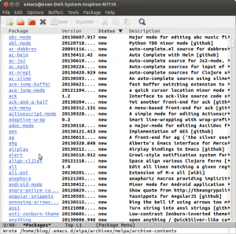
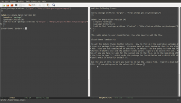
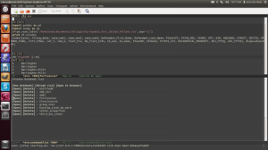

title: Emacs-IPython-Notebook Installation Tutorial
date: 2013-06-24 23:37
author: emisshula
category: Tutorials
tags: Emacs, emacs-ipython-notebook, ipython, tutorial
slug: emacs-ipython-notebook-installation-tutorial

# Packages

The Emacs package system is far from perfect. The most proficient
users of Emacs are unaffected by this flaw. Many users of Emacs are
experts who live at the bleeding edge of the linux kernel and gcc
compiler.  This guide is for the mere mortals who have used Emacs for
either its superb integration with R through [ESS](http://ess.r-project.org/) or the Carsten
Dominick's ubelieveable [org-mode](http://orgmode.org/) that threatens to make even PhD
students productive. Basic Emacs is extraordinarily powerful and you
can add a few packages with minimal knowledge. Vincent Goulet has
helped thousands of frantic stats students with his [Modified Emacs for
Windows](http://vgoulet.act.ulaval.ca/en/emacs/windows/) and [Mac OSX](http://vgoulet.act.ulaval.ca/en/emacs/mac/). However as you want to move past that you have to
add packages yourself.

# Gods vs Mortals

All packages can be downloaded as source. This can be very tricky as
many packages depend on other packages which can be hard to configure
for us mere mortals. When possible it is advisable to avoid this and
use a trusted repository. A repository pools the effort and when
possible automates the effort involved in keeping up to date. This is
important as bugs and security flaws in all software are discovered
over time. In this tutorial, I am going to install such a
package. Another amazing piece of scientific computing is Fernando
Perez's [IPython](http://ipython.org/). See my [other-blog-post](http://evanmisshula.github.io/setting-up-a-virtual-environment-with-nummpy-and-pandas) about setting up a virtual
environment for IPython. The notebook whose developed was led by Brian
Granger and Min Reagan Kelly revolutionizes both interactive computing
and computer language pedagogy. No single blog is long enough to
defend such grandiose claims, but I am pretty amazed. I just hate
editing in the browser.

# The Package Systems

The best blog post I found on the emacs package system was from [Xah Lee](http://ergoemacs.org/emacs/emacs_package_system.html). I will
work hard to add something here. There are six package systems in emacs
24.x. They are:

1.  [elpa](http://elpa.gnu.org/)
2.  [tromey-elpa](http://tromey.com/elpa/)
3.  [marmalade](http://marmalade-repo.org/)
4.  [milkbox](http://melpa.milkbox.net/)
5.  [DELPS](http://www.emacswiki.org/emacs/DELPS)
6.  [el-get](http://www.emacswiki.org/emacs/el-get)

The first is the official system. I am not going to cover tromey,
marmalade-repo or DELPS. I just don't know them yet. I was able to
install other packages successfully in el-get. It did not work for me
with the Emacs-IPython-Notebook.

# Let's get started

So you may not have a .emacs file. This file loads all of your
customization files into emacs. Create it if you don't.

    touch .emacs

Now find it `C-x C-f ~/.emacs` (The capital 'C' means control.)

Add the following lines:

    (setq package-archives '(("gnu" . "http://elpa.gnu.org/packages/")
     ))
    
    (when (>= emacs-major-version 24)
       (require 'package)
       (package-initialize)
       (add-to-list 'package-archives '("melpa" .
    "http://melpa.milkbox.net/packages/") t)
       )

This adds melpa to your repositories. You also need to add the line

    (load-theme 'zenburn t)

to get the zeburn theme (better colors).

# Package-menu

Now to list all the available packages. Type `M-x
package-list-packages`. (M means Meta on most keyboards that is the
Alt key. Also use tab completion if possible, it helps!) We are going
to take two packages. Takafumi Arakaki's brilliant [ein](https://github.com/tkf/emacs-ipython-notebook) and the zenburn
theme colors. Type `C-s` to search for ein in the package list, not the
github repo. As of now you have to look for the second one in the
file.  Go to the beginning of the line to type `i` which marks the
package for installation and x which will signal emacs to actually
install it.  Repeat the same for the zenburn package.

# Load it into Emacs to see the change

But for any of this to work you have to re-run the .emacs file. Type
`M-x eval-buffer`.

## newColors

If everything works the colors will change. You can examine
repository for this post including a working .emacs file (and my
personal .emacs file) at my github repo which is linked here.

Now to start the notebook. Go to the directory with a notebook or where
you want to keep them and open a new shell. Type:

    ipython notebook --pylab=inline

Back in emacs type.

The pay-off

---

M-x ein:notebooklist-open

Click on open new notebook and your IPython notebook is in your buffer
where it always belonged.

I will cover el-get in the next blog&#x2026;.I promise!