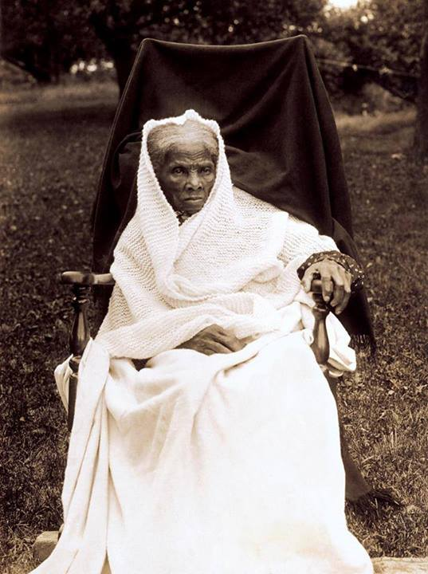

title: Tubman Yortzight
date: 2014-05-08 15:02
author: emisshula
category: Criminal Justice
tags: slavery, heroes
slug: tubman-yortzight

> "Most that I have done and suffered in the service of our cause has
> been in public, and I have received much encouragement at every step
> of the way. You, on the other hand, have labored in a private way. I
> have wrought in the day—you in the night. … The midnight sky and the
> silent stars have been the witnesses of your devotion to freedom and
> of your heroism.” ~Fredrick Douglas (on Harriet Tubman)

