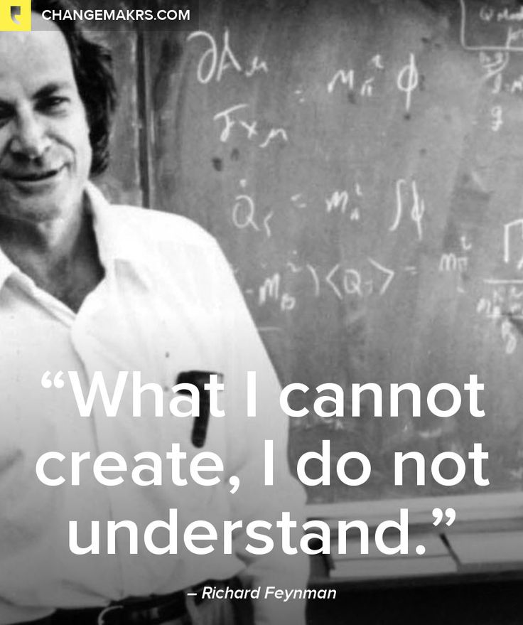

title: CSCI-380-01
modified: 2017-08-26
tags: teaching, math
slug: CSCI380-01
label: CSCI380-01
authors: Evan Misshula
summary: Mobile Apps

# Class info

<table border="2" cellspacing="0" cellpadding="6" rules="groups" frame="hsides">

<colgroup>
<col  class="org-left" />

<col  class="org-left" />
</colgroup>
<tbody>
<tr>
<td class="org-left">Class Number</td>
<td class="org-left">CSCI 380-01</td>
</tr>

<tr>
<td class="org-left">&#xa0;</td>
<td class="org-left">Mobile Apps for Social Justice</td>
</tr>

<tr>
<td class="org-left">Instructor</td>
<td class="org-left">Evan Misshula</td>
</tr>

<tr>
<td class="org-left">Credits</td>
<td class="org-left">3</td>
</tr>

<tr>
<td class="org-left">Enrollment</td>
<td class="org-left">28</td>
</tr>

<tr>
<td class="org-left">Semester</td>
<td class="org-left">Fall 2017</td>
</tr>

<tr>
<td class="org-left">Room</td>
<td class="org-left">6.64-02 NB</td>
</tr>

<tr>
<td class="org-left">Time</td>
<td class="org-left">MW 7.20 - 8.35</td>
</tr>
</tbody>
</table>

# Introduction

The vast majority of Amercan's, 95% own a cell phone. Of these, 77% own a 
smart phone, up from 35% in 2011. <a id="fnr.1" class="footref" href="#fn.1">1</a> Smart phones are owned by 92% of 
adults 18-29 and 88% of adults 30 - 49%. <a id="fnr.2" class="footref" href="#fn.2">2</a> 

Programming mobile apps has been a slow and arduous process with
Android requiring Java and Apple's iOS requiring Objective-C and more
recently Swift. In respon to this unfortunate situations in 2015
Facebook extended its enormously successful ReactJS library to create
Native Mobile Application in Javascript.

## Why not just use Javascript?

Clojurescript has a number of advantages over Javascripts well known shortcomings.
Students should watch [Javascript Wat?](https://www.destroyallsoftware.com/talks/wat) for an entertaining introduction to Javascipts
implicit type conversion and other idiosyncracies.

# Background

There has been a revolution in programming languages in the last ten
years.  This class will introduce you to the practice of functional
programming which makes it easier for you to write elegant, fast and
maintainable code.

The class will be a success if some of these
tools make the rest of your career (research, government or
industrial) more productive and enjoyable.The syllabus will be updated
as the course progresses.  The schedule is not currently set and will
be starting to be updated soon. You are welcome (and encouraged) to
make your own recordings of the lectures.

# Location and Time

-   Where: Rm: 6.64.02, New Building, CUNY John Jay
-   When: Mondays and Wednesdays 7.20 - 8.35

# Texts

The texts are available free online:

-   Daniel Higgenbotham [Clojure for the Brave and True](https://www.braveclojure.com/clojure-for-the-brave-and-true/)
-   Andrey Antukh and Alejandro Gómez [ClojureScript Unraveled](http://funcool.github.io/clojurescript-unraveled/)

# Computers in the classroom

This is a hands on class.  You will be in front of a computer during
class throughout the semester.  Please feel free to use the computer
to take notes or use the class Etherpad to discuss the course
material, but do **not** use the computers for non-class related topics.

# What is the goal of the class?

-   Create your own Native Mobile App which at your choice may be distributed
    through the Apple's App Store or Google play.

-   If the class is successful students will be able to use general
    principles for data representation & manipulation.  They will write
    efficient, maintainable and modular code.

-   Students will be able to create their own mobile applications which interact 
    with a database and other public API's. Students will also be able to create 
    interactive, dynamic and personalized Single Page web applications as well.

-   Students will become familiar with tools for contributing to open
    source projects and open source resources for learning new
    languages, joining new programming communities and obtaining
    employment in emerging languages.

# Learning objectives

Upon completing the course, you should be able to:

-   Connect to the IRC channel for your language, construct a minimal
    example and ask an appropriate question.
-   Write Clojure programs using recursion, higher order functions and 
    user defined types.
-   Write a single page mobile app with API's and connections to a database
-   Describe the major categories of Languages and the Software Life Cycle
-   Understand the scope rules, type system, parameter passing and data
    abstraction of a language.
-   Describe the fudamentals of compilers, transpilers and interpreters

Most of these are drawn from the ACM's [CS Curriculum 2013](https://www.acm.org/education/CS2013-final-report.pdf)

# What will be covered?

All of the technologies have been chosen to be readily available and
likely to be around for many years to come.  You will gain experience
with the following (do not worry if you have not heard of some or all
of these).  Because this is a one semester class, we will not be able
to go into depth on these topics, but this should provide the
foundation for you to learn more when you need or want to.

Note: this is not the order that we will cover the material and we
might not get to all of these in class.

-   Programming Paradigms
-   Installing Clojure
-   Emacs, Meetups, Git and IRC clients
-   Introduction Imperative verses Functional programming
-   Clojure  & Functional Basics
-   Scalar Data Types, Composite types, Lazy evaluation
-   Functional forms, recursion
-   Lambdas, Closures, Macros
-   Namespaces, Multi-methods
-   Lazy evaluation, Immutability
-   Pure functions, first-class functions
-   Currying, memorization, high order functions
-   List compressions, restructuring
-   Collection pipelines
-   Testing, Clojure - Java interoperation
-   Concurrency & Mutation
-   Vars, Refs, Agents, Atoms, promises, futures
-   Functional programming, Web Apps, Databases
-   Single Page Applications and Mobile Apps

# Grades

There will a few programming assignments. The problems will be
difficult.  There will be frequent quizzes at the beginning and end of
class. There will not be a final.  During the final time period there
will be a "science fair". Administrators, Non-profits, Venture
Capitalists and potential employers will be invited in and students
will present their work.

If there is no test your grade for the day will be based on
your participation and preparation will determine your grade for the
day. Successful completion of all homework should guarantee a grade of
'A'. Be warned, this is a demanding class.

> The general rule of thumb regarding college studying is, and has been
> for a long time, that for each class, students should spend
> approximately 2-3 of study time for each hour that they spend in
> class. Many students carry a course load of 15 credits, or
> approximately 15 hours of class time each week.

<http://bit.ly/1wwrUR1>

If students are spending considerablely more than 7.5 hours per week
on the homework, they are advised to speak with the instructor and 
adjustments will be made.  If you put int the time, there is no reason 
not to get an outstanding mark.  Do not try to game the system by not 
doing the homework and making it up on the exams.  That strategy has not 
been successful yet.

# Office hours

I will usually be available before class in my office 6.63.35 NB or
downstairs in Little Jay's Cafe.  I live far from from campus so my
ability to stay after class is limited.

# ATTENDANCE POLICY

Students enrolled in this course are required to attend all lecture,
recitation and laboratory sessions of the section for which they
registered. (During summer session, two weeks of classes are covered
each calendar week.) Excessive absences (defined above) will result in
a reduction in the grade. Attendance is taken solely from roll sheets
circulated at the beginning and/or end of each session. Lateness or
early departure (resulting in missing no more than 15 minutes of a
session) counts as 1⁄2 absence. Students missing more than 15 minutes
of a session will be counted as absent. If the college is officially
closed, thereby canceling all classes, an announcement will be found
on 237-8000, and broadcast on AM stations WINS (1010), WOR (710), WCBS
(880), WADD (1280), WMCA (570), WLIB (1190), and WFAS (1230), as well
as FM stations WCBS (101.1) and WBLS (107.5). If a class will be
cancelled for extraordinary circumstances, the instructor will email
an announcement to the preferred email of enrolled students as soon as
practicable. This has not happened in recent memory.

# ACTIVE COLLEGE E-MAIL

Students are expected to maintain active and accessible college email
and Blackboard accounts. Blackboard will be used to send emails and
may be used to post announcements, handouts, additional study
materials, text supplements, grades, etc. Use the CUNY Portal Login
page help features for a forgotten username or password, or contact
DoIT, 212-237-8200 for other help. Verify your CUNY email address is
correctly listed on Blackboard and keep the mailbox from filling up
and refusing delivery, because you will be responsible for the
contents of any email sent to that account. 

When emailing instructors for this course, start the email’s subject
line with the course and section number (e.g., CSCI 372-01) followed
by a brief description. Include your full name in the body of every
email. Emails that do not contain these descriptive details may be
considered spam, and remain unopened and unanswered. Students are
expected to check email regularly.

# ADA STATEMENT: STUDENTS WITH DISABILITIES

Qualified students with disabilities will be provided reasonable
academic accommodations if determined appropriate by the Office of
Accessibility Services (OAS), 212- 237-8031, located in room
L.66.00. Prior to granting disability accommodations, verification of
a student’s eligibility must be timely received from OAS by the math
department chairman, Professor Douglas Salane (dsalane@jjay.cuny.edu),
and the instructor, from the OAS. It is the student’s responsibility
to initiate contact with the OAS and to follow the established
procedures for having the accommodation notice sent to both the course
coordinator and the instructor.

# ACADEMIC INTEGRITY:

Students who succeed in this course and graduate with a degree in
Computer Science and Information Security may be hired by government
or private agencies to analyze evidence and testify in a court of law,
placing in jeopardy another person’s reputation and/or
liberty. Dishonesty of any kind cannot and will not be
tolerated. Students are expected to become thoroughly aware of the
“John Jay College Policy on Academic Integrity” (and other college
policies), available on the college’s Web site. Sanctions to the
extent permitted by the policy will be imposed and any written
material submitted may be transmitted by the instructor to
Turnitin.com (or equivalent service) to help analyze its
originality. See the Undergraduate Bulletin for the College’s Policy
on Plagiarism and Cheating, which will be strictly
enforced. Plagiarism includes copying ASA or homework answers from
others. You are required to do your own work to avoid severe grade and
disciplinary penalties. The College subscribes to Turnitin.com and
Blackboard has a similar module called SafeAssign. Any written
assignments submitted may be subject to evaluation by these or similar
programs.

# Statement on Poverty, Food Insecurity and Homelessness

Students experiencing temporary homelessness or food insecurity are 
encourged to see the instructor and contact Counseling Services at 
the Wellness Center.  I am proud that CUNY John Jay provides both 
an emergency food bank and small grants for student emergencies through
the Petrie Student Emergency Fund.

Location: New Building L.68.00
Phone: 212.237.8111
Email: counseling@jjay.cuny.edu

# Services for undocumented students

Undocumented students can avail themselves of a variety of services through John
Jay, most of which can be found at:

<http://jjay.cuny.edu/undocumentedstudents>

Please inform the instructor if your immigration status makes
completing the assignments in a timely manner difficult or impossible.

# Acknowledgement

Although I wanted to teach this material for a long time.  I have been
a serial language learner since 2009.  My path has been Basic (1979)
-> Pascal (1983) -> APL(1985) -> Gauss (1988) -> Fortran (1989) -> C++
(1990)-> S+ (1991) -> Visual Basic (1992) -> Mathematica (2006) -> R
(2008) -> eLisp (2009) -> Ruby (2009) -> Javascript (2009) -> Java
(2009) -> Python (2011) -> Scheme (2014) -> Go (2016) -> Clojure
(2016) -> Haskell (2016).  How to layout this material owes a great
deal to [Peter Drake](https://sites.google.com/a/lclark.edu/drake/) and [Roger Whitney](http://www.eli.sdsu.edu/courses/fall15/cs696/index.html) whose considerable open source
materials I have borrowed from liberally. I hope this course will add
some orthogonal contributions.

# Footnotes

<a id="fn.1" href="#fnr.1">1</a> <http://www.pewinternet.org/fact-sheet/mobile/>

<a id="fn.2" href="#fnr.2">2</a> Ibid.
